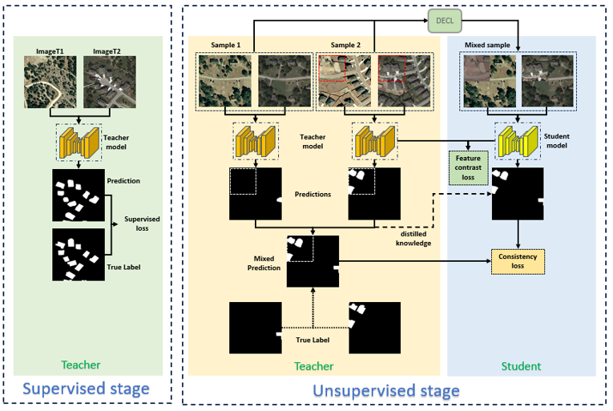

<p align="center">
  <b>Dual Noise Augmented Consistency Learning for Semi-Supervised Building Change Detection</b>
</p>

Official PyTorch implementation of **DACL-CD**, a semi-supervised learning framework for building change detection (BCD) from bi-temporal remote sensing images. The method integrates **dual-noise augmentation CutMix learning**, a **progressive teacher–student consistency learning framework**, and a **feature difference-weighted spatial attention module (FDSAM)** to effectively exploit unlabeled data under limited annotations.


## Framework Overview



**Figure 1.** Overall architecture of the proposed DACL-CD framework, consisting of a supervised stage and an unsupervised (teacher–student consistency learning) stage.


## Installation

```bash
# Clone the repository
git clone https://github.com/lizhenxing02/DACL-CD.git
cd DACL-CD

# (Recommended) create a conda environment
conda create -n dacl python=3.9 -y
conda activate dacl

# Install dependencies
pip install -r requirements.txt
```

### Environment

- Python >= 3.8
- PyTorch >= 1.12
- torchvision

---

## Data Preparation

We use three public building change detection (BCD) datasets:LEVIR-CD、WHU-CD and S2Looking.
Crop the original images to **256 × 256** following the paper, then organize the dataset folder as:

```
DACL-CD/
├─ LEVIR-CD/
│  ├─ train/
│  │  ├─ A/          # T1 (pre-temporal) images
│  │  ├─ B/          # T2 (post-temporal) images
│  │  └─ label/      # binary change masks
│  ├─ val/
│  └─ test/
├─ WHU-CD/
└─ S2Looking/
```

---

## Usage

### Training

```bash
# Train on LEVIR-CD with 5% labeled samples
python train_LEVIR.py --data_root ./LEVIR-CD --ratio 0.05

# Train on WHU-CD with 10% labeled samples
python train_WHU.py --data_root ./WHU-CD --ratio 0.10
```

**Key hyper-parameters** (defaults follow the paper):

| Argument | Description | Default |
|---|---|---|
| `--dataset` | Dataset name: `LEVIR-CD` / `WHU-CD` / `S2Looking` | `LEVIR-CD` |
| `--label_ratio` | Supervised labeled ratio: `0.05 / 0.10 / 0.20 / 0.40` | `0.05` |
| `--epochs` | Total training epochs (30 supervised + 70 unsupervised) | `100` |
| `--batch_size` | Training batch size | `32` |
| `--lr` | AdamW learning rate | `1e-4` |
| `--weight_decay` | Weight decay | `1e-4` |
| `--alpha_ema` | EMA smoothing coefficient for teacher model | `0.99` |
| `--mask_size` | Salient mask size used in DNACL | `64` |


### Testing / Evaluation

```bash
python inference_LEVIR.py --data_root ./LEVIR-CD 
```

**Evaluation metrics:** Precision, Recall, F1-Score, IoU, Overall Accuracy (OA).

---

## Citation

If you find this repository useful for your research, please consider citing our paper:

```bibtex
@article{li2026daclcd,
  title={Dual Noise Augmented Consistency Learning for Semi-Supervised Building Change Detection},
  author={Li, Zhenxing and Li, Wenzhuo and Zhang, Hongjuan and Liu, Jin and Sun, Kaimin},
  journal={},
  year={2026}
  doi={}
}
```


